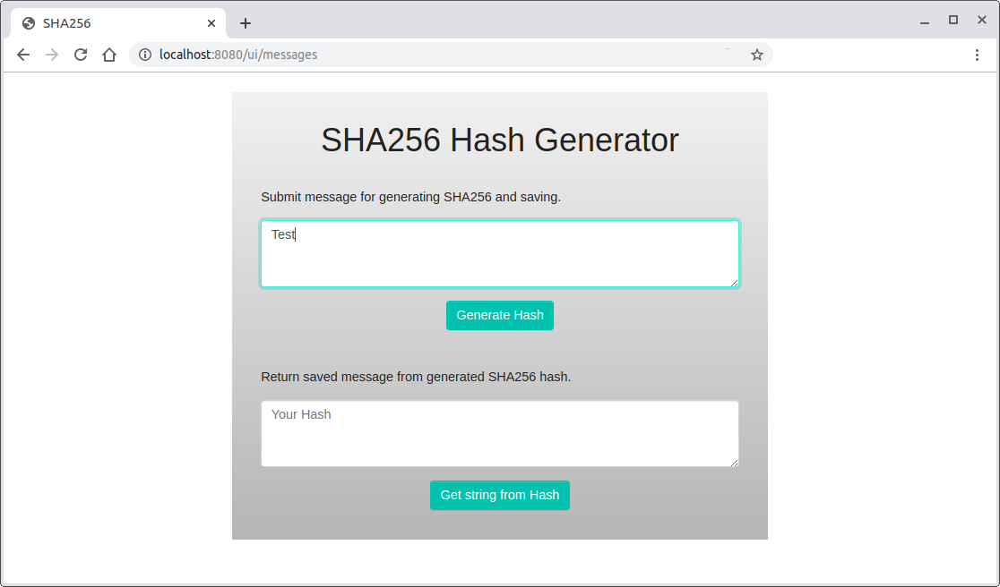
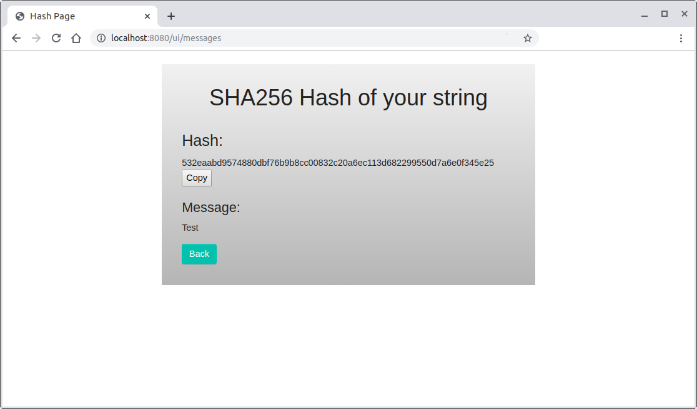
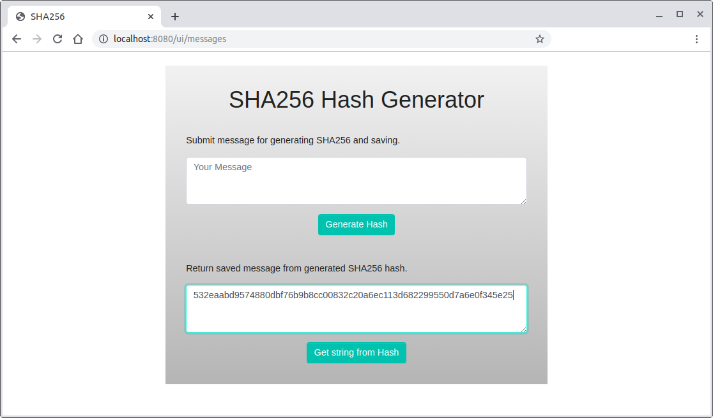
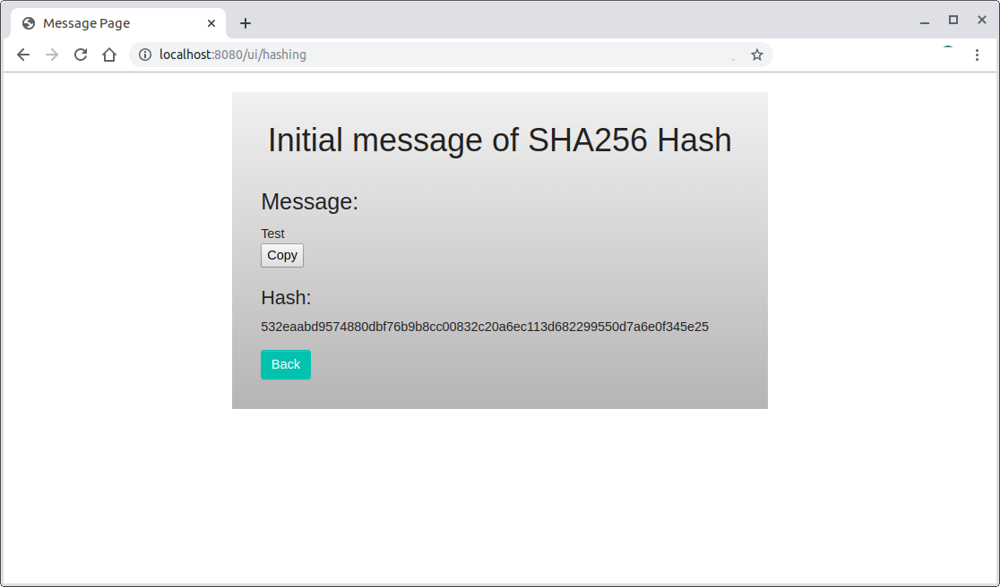
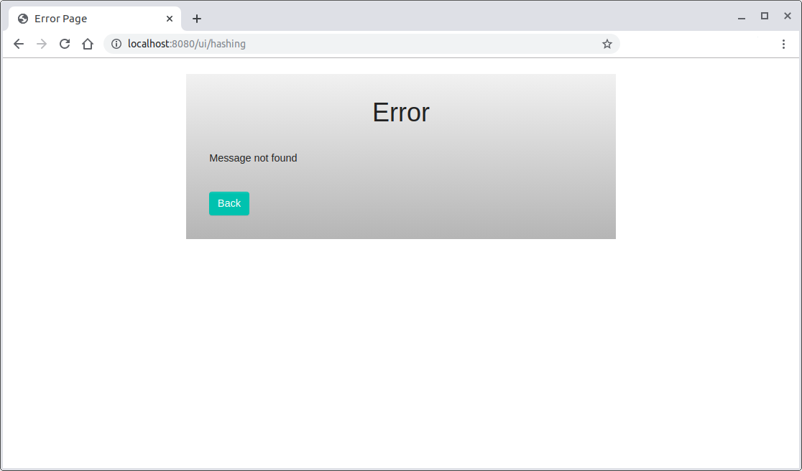
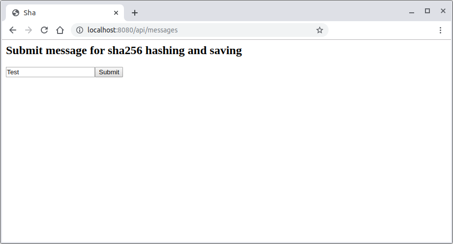
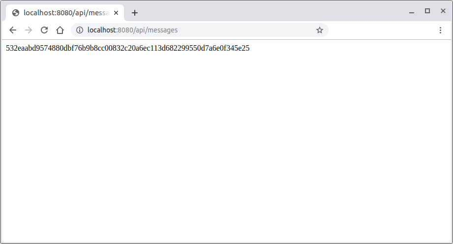
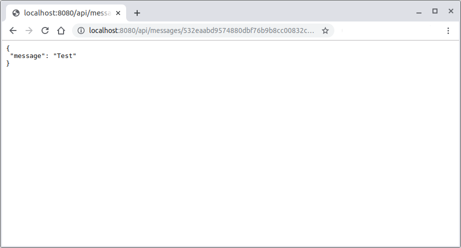
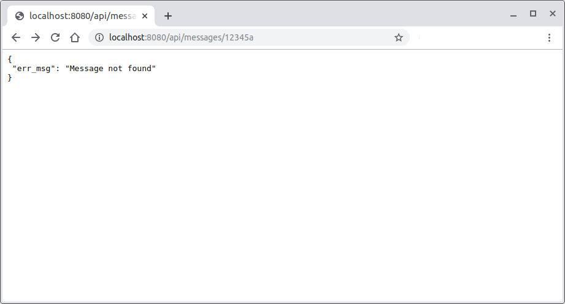

# NodeJS Backend Script To Calculate and Manage Hashes

An API system that calculates and manages SHA256 hashes and shows if a string already exists in the system.

----

## Description


### UI

> Design a UI interface for hashing a string message and saving it in the database, and for retrieving the message from the database based on the Sha256 hash.

### API

> Publish a small service on the web that has two endpoints:
>
> 1. **/messages** takes a message (a string) as a POST and returns the SHA256 hash digest of that message (in hexadecimal format)
>
> 2. **/messages/< hash >** is a GET request that returns the original message. A request to a non-existent <hash> should return a 404 error.

>```bash
>$ curl http://mywebsite.com/messages/2c26b46b68ffc68ff99b453c1d30413413422d706483bfa0f98a5e886266e7ae
> {
> "message": "test"
> }
> $ curl -i
> http://mywebsite.com/messages/gddfhfghgjj
> HTTP/1.0 404 NOT FOUND
> Content-Type: application/json
> Content-Length: 36
> Server: Werkzeug/0.11.5 Python/3.5.1
> Date: Wed, 31 Aug 2016 14:21:11 GMT
> {
> "err_msg": "Message not found"
> }

---

## Usage

Running: 

`DBPWD=<dbpassword> node app.js`

Test:

open browser and navigate to `<IP>/` or

`http://<IP>:8080/messages`

`http://<IP>:8080/messages/12...`

----

## Usage with Docker

Build an image:

`docker build -t node-vanilla -f Dockerfile .`

Run the container:

`docker run -it --rm -p 8080:8080 -v $PWD:/root/ node-vanilla`


----


## Screenshots


### UI














### API












---
